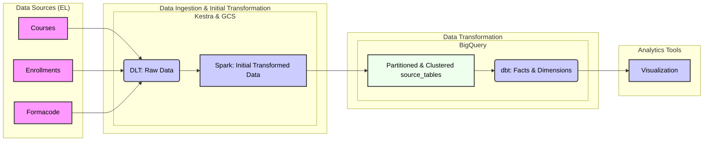

## Project Overview

This project focuses on building an end-to-end data pipeline to analyze training course and enrollment data within the French market. The goal is to track course trends over time, understand enrollment patterns, and provide actionable insights through a dashboard.

**Datasets Used:**

1.  **Courses Data:** [Mon Compte Formation Catalogue](https://opendata.caissedesdepots.fr/explore/dataset/moncompteformation_catalogueformation/information/?disjunctive.libelle_niveau_sortie_formation&disjunctive.nom_region&disjunctive.nom_departement&disjunctive.type_referentiel&disjunctive.code_region) - Contains information about available training courses, including provider details, course titles, and regions.
2.  **Enrollments Data:** [Entree Sortie Formation](https://opendata.caissedesdepots.fr/explore/dataset/entree_sortie_formation/information/?disjunctive.type_referentiel&disjunctive.mois) - Provides monthly enrollment data, showing the number of trainees enrolled in specific courses.
3.  **Formacode Data:** [Formacode Centre Inffo](https://formacode.centre-inffo.fr/telechargements-54.html) - Classifies training programs by skills (using Formacode codes) and includes descriptions and semantic fields. There are 5 formacodes allowed to be assigned to `Courses`.Example with their description is as below:
    - 31025: Data Analytics
    - 31026: Data Science
    - 31028: Artificial Intelligence
    - 31035: Data Visualization

    Other than this there is a column `field`which contains 65 semantic field that helps in grouping the formacodes at higher level. For example, all the above would be part of ÌT and information systems. Other Example wold be Financial Management account. 

**Problem Statement:**

The primary objective is to develop a dashboard that visualizes:

* The monthly evolution of training courses, allowing for trend analysis and identification of new course launches.
* Enrollment patterns over time, showing the popularity of different courses and providers.

A key challenge is the lack of historical course launch dates. To address this, the pipeline is designed to capture monthly snapshots of course data, enabling retrospective analysis. So, if in the data today it shows there are 7 providers giving courses on data analytics, there is no way to find out what was the number 3 months back.

Additionally, the enrollment dataset's potential for data resets necessitates an incremental data ingestion approach. 

The formacode dataset, in French, requires translation and processing for broader stakeholder understanding.

## Data Pipeline Architecture

**Technologies Used:**

* **Cloud:** Google Cloud Platform (GCP)
* **Workflow Orchestration:** Kestra
* **Data Lake:** Google Cloud Storage (GCS)
* **Data Warehouse:** BigQuery
* **Batch Processing:** Apache Spark (Databricks Delta Live Tables(DLT))
* **Data Transformation:** dbt Cloud
* **Data Transformation:** Looker

**High Level Architecture**


**Pipeline Components:**

1.  **Data Ingestion (Batch):**
    * **Courses Data:** DLT is used to extract the course data from the source, store it as raw data in GCS, perform initial Spark transformations, and load it into BigQuery, partitioned by `data_extracted` and clustered by `code-formacode-1`. Everytime it runs, this will upload any new incoming rows while retaining the old ones. 
    * **Enrollments Data:** DLT is used to extract the enrollments data from the source, store it as raw data in GCS, perform initial Spark transformations, and load it into BigQuery, partitioned by `year_month` and clustered by `provider`. Everytime it runs, this will upload any new incoming rows while retaining the old ones. 
    * **Formacode Data:** Kestra downloads the Formacode ZIP file, extracts relevant data, translates descriptions and field columns using Spark, and stores the processed data in BigQuery. Broadcast variables in Spark are used for semantic fields translation. This flow will write truncate the file in bigquery which means that it will delete all the old records and insert new. 

2.  **Workflow Orchestration (Kestra):**
    * A single Kestra workflow is created to orchestrate the courses and enrollments data pipelines, scheduled to run on the first Sunday of each month at 3 AM. Please refer to the [Courses Enrollments Kestra Workflow Topology](/screenshots/Courses%20Enrollments%20Kestra%20Workflow%20Topology.pdf) for the whole flow. 
    * A seperate kestra workflow is created to handle the formacode download, extraction, translation and upload. It is once in a while job as it remains more or less constant. Please refer to the [Formacode Kestra Workflow Topology](/screenshots/Formacode%20Kestra%20Workflow%20Topology.png) for the whole flow.

3.  **Data Transformation (dbt Cloud):**
    * dbt Cloud is used to build data models for the final fact and dimension tables in BigQuery.
    * Please refer to the [DBT Lineage Graph](/screenshots/DBT%20Lineage%20Graph.png) to understand the workflow. 
    * A dbt macro is implemented to remove leading numbers from the `field` column in the Formacode data. This macro could be leveraged in future to remove leading digits in `generic_term`.
    * An environment variable `DBT_ENVIRONMENT` is used to control data limiting in the `stg_courses` model (development: limit to 100 rows, production: full dataset). This can be overridden using local variables `limit_data` and further by passing false to the variable in command-bar.
    * Tests are included in the dbt project to ensure data integrity. There are warnings issued showing that there are few formacodes listed in courses which are not part of formacode dimension file. These can be ignored for now. 
    * The project includes both development and production environments, with Monthly job creation and CI/CD job for deployment.

4.  **Data Warehouse (BigQuery):**
    * BigQuery is used as the data warehouse, with tables partitioned and clustered for optimal query performance.
    * Local SQL queries are provided for data verification and reconciliation at different steps. 

## Dashboard

**Tool:** Google Data Studio

The [dashboard](https://lookerstudio.google.com/reporting/71ceb6ee-f472-4892-8e08-6689d9dbd42c) includes two tiles:

1.  **Distribution of Course Categories:** A graph showing the distribution of courses across different Formacode categories, providing insights into the areas with trainings and providers. I have come up with a `KPI` here which is `Trainings Provider Ratio`. It is the ratio of total number of trainings and total number of providers. If 10 providers are providing 150 bootcamps for a technology, then BPR = 150/10 = 15. The interpretation is:
    - LOW: might indicate less demand due to lower number of trainings or overcrowdedness due to high number of providers.
    - HIGH: might indicate oversaturation due to too many trainings or less competition due to less number of providers. 
    We suggest to look at the TPR between 5 and 15. 

2.  **Monthly Enrollment Trends:** A line graph illustrating the monthly enrollment trends for selected courses or providers, highlighting temporal patterns and growth.

* A screenshot of the visualization after selecting the `formacode_field` as `IT and information systems`and `training_provider_ratio`between 5 and 15 can be found [here](/screenshots/Visualization%20screenshot.png). 

## Reproducibility

### Automation (If you prefer manual, please scroll down.)

**Prerequisites:**

* GCP project with billing enabled. Rest of the tasks like service account creation, IAM roles assignment, bucket creation, dataset creation, kestra dockerization will be executed by the script.

**Steps tp Run:**

1. **Clone the Repository:**
    ```bash
    git clone git@github.com:jugnuarora/france_courses_enrollments.git
    cd france_courses_enrollments
    ```

2. **In the terminal, execute ./setup.sh and follow the instructions**

3. **Verify Data:**
    * I prefer to reconcile my tables and thus created some local queries for it that can be run in BigQuery. Import the [local_queries.sql](/local_queries.sql).
    * Execute Query 1, 4 and 10 to see the reconciliation table for courses.
    * Execute Query 11, 14 and 20 to see the reconciliation table for enrollments.
    * Execute Query 21 and 27 to see the reconciliation table for formacode. 
    * run the provided sql queries (local_queries) to verify the data. The final tables should have the count as below:
        . courses (Query 9) - ~195K records
        . enrollments (Query 19) - ~181K records
        . formacode (Query 26)- ~3379 records

4. **Visualize in Dashboard:**
    * You can access the visualization [here](https://lookerstudio.google.com/reporting/71ceb6ee-f472-4892-8e08-6689d9dbd42c).

### Manual

**Prerequisites:**

* GCP account with Billing enabled.
* Kestra instance running.
* dbt Cloud account with BigQuery connection.
* Service account keys for GCP authentication.

**Steps to Run:**

1.  **Clone the Repository:**
    ```bash
    git clone git@github.com:jugnuarora/france_courses_enrollments.git
    cd france_courses_enrollments
    ```
2. **Setting up the Cloud:**

    __Step 1:__ Create a project on Google Cloud. The name of the project for me is `france-courses-enrollments`. But it can be different.

    __Step 2:__ Create a service account by clicking on IAM. I have kept the service account name as `france-courses-enrollments`. But it can be different.
    Select roles `Storage Admin`and `BigQuery Admin`.
    Also generate the json key and store it safely for further connection to GCS and bigquery. 

    __Step 3:__ Add a billing account to this project.

    __Step 4:__ Create a cloud storage bucket. For me it is `jugnu-france-course-enrollments`, but it can be different. Select suitable region. I have selected `europe-west1 (Belgium)`. 

3.  **Configure Kestra:**

    __STEP 1:__ Run `docker compose up`. Access Kestra on `localhost:8080`.

    __STEP 2:__ Import the Kestra workflows 

        . 01_gcp_kv.yaml

        . 02_courses_enrollments_pipeline.yaml

        . 03_formacode_pipeline.yaml

    __STEP 3:__ Execute `01_gcp_kv.yaml` to set up the key value pair. Later on you can modify them with the values that corresponds to your set-up by going to namespaces, selecting `france-courses-enrollments` and then selecting `KV Store`. You will need following key value pairs:

        . GCP_CREDS - It has the same content as the json file generated from google cloud.

        . GCP_DATASET - It is the same name as database in Bigquery.

        . GCP_BUCKET_NAME - It is the same name as Bucket in Google Cloud Storage.

        . GCP_PROJECT_ID - It is the Project Id that is automatically generated when creating the new Project on Google Cloud.

        . GCP_LOCATION - I had chosen europe-west1

4.  **Bigquery Set-up:**

    Make sure to have following dataset in bigquery:

        . source_tables

        . external

    These are required for the kestra workflow to generate the source tables.

5.  **Configure dbt Cloud:**

    __Step 1:__ Create a new account `france-market-research`.

    __Step 2:__ Create a new connection to `BigQuery` using the json file generated. Please note that the location of the dataset creation is europe-west1 (or whatever you have mentioned for the warehouse and data lake set up).

    __Step 3:__ Create a new project and give details of the repository and the [project subdirectory](/screenshots/Project%20Subdirectory.png) as `dbt`. Add repository using GitHub. Project subfolder is a must since the whole dbt resides in the `dbt`folder of the repository. 

    __Step 4:__ Create a development environment. Please note that the location of the dataset creation is europe-west1 (or as per your GCP set-up), Connection is Bigquery. The dataset name is 'dbt_models', but it can be different also. 

    __Step 5:__ Create [environment variable](/screenshots/DBT%20Environment%20Variable%20setting.png) `DBT_ENVIRONMENT`, where Project default will be `production`and development will be `development`. Later on when we would create production environment, we will add the value for that environment as well. 

    __Step 6:__ Now, you can access the contents of the project repository in Develop Cloud IDE. 

    __Step 7:__ In `stg_courses`there is a variable defined `limit_data`, which is true if the environment variable `DBT_ENVIRONMENT`is `development`. To override it in development, `dbt run --vars '{"limit_data": false}'`. Otherwise, by default in development, it will only give 100 rows.

    __Step 8:__ Set-up the `Production`environment.

    __Step 9:__ Create a new [job](/screenshots/DBT%20Monthly%20Job.png) `Monthly`, which will run in production environment and I have set the Schedule as Cron Schedule for Monthly to be run at 22:00 hrs UTC on 5th of every month. 

    __Step 10:__ Create a new CI/CD [job](/screenshots/DBT%20CI%20CD%20Job.png) `deploy_dbt_prod`, which will run as soon as there is a merge in the main branch of the git hub repo associated. See the screenshot.

5.  **Run Kestra Workflows:**
    * Trigger the Kestra workflow 02_courses_enrollments_pipeline.yaml to start the data ingestion and processing pipelines for courses and enrollments respectively. Execute it to generate the courses source table and enrollments source table. The course source table is partitioned by data extract and the code_formacode_1. The enrollments table is partitioned by year_month and clustered by provider.

    * Trigger the Kestra workflow 03_formacode_pipeline.yaml to start the data ingestion and processing pipeline for formacode. This will take some time to execute (almost 45-50 mins) because of the translation.

6.  **Verify Data:**
    * I prefer to reconcile my tables and thus created some local queries for it that can be run in BigQuery. Import the [local_queries.sql](/local_queries.sql).
    * Execute Query 1, 4 and 10 to see the reconciliation table for courses.
    * Execute Query 11, 14 and 20 to see the reconciliation table for enrollments.
    * Execute Query 21 and 27 to see the reconciliation table for formacode. 
    * run the provided sql queries (local_queries) to verify the data. The final tables should have the count as below:
        . courses (Query 9) - ~195K records
        . enrollments (Query 19) - ~181K records
        . formacode (Query 26)- ~3379 records

7.  **Run dbt Models:**
    * Execute the dbt models in dbt Cloud to transform the data. You can execute in one of the ways listed below:
        - Using dbt command bar and giving:
            `dbt run --vars '{"limit_data": false}'
        
        - Executing the Monthly job now. The monthly job once finished will generate the [docs](/screenshots/DBT%20Documentation%20after%20Monthly%20job.png) as well.

8.  **Visualize in Dashboard:**
    * You can access the visualization [here](https://lookerstudio.google.com/reporting/71ceb6ee-f472-4892-8e08-6689d9dbd42c).
    

## Going the Extra Mile (Optional)

* **Tests:** Included dbt [tests](/screenshots/DBT%20Job%20run%20log%20-%20models,%20data%20tests.png) for data integrity.
* **CI/CD:** CI/CD [pipelines](/screenshots/DBT%20CI%20CD%20Job.png) set up for dbt Cloud deployment.
* **Documentation:** This README provides detailed instructions and explanations. Even the production jobs (`Monthly`or `deploy_dbt_prod`) once run will produce the [documentation](/screenshots/DBT%20Documentation%20after%20Monthly%20job.png). 

## Future Improvements

* Use Terraform for Virtualization
* Explore real-time data ingestion for enrollment data.
* Optimize the Formacode translation job.
* Install dependency of DBT Job on the Kestra workflow execution.

## Folders/Root Files Information
 
* `dbt`- This includes the dbt cloud project.
* `lib`- This contains the jar files required for spark job.
* `screenshots`- Various screenshots refered in this README are stored in this folder. These are highlighted as you read through the document.
* `scripts`- All python scripts that are needed in Kestra workflows are stored in this folder.
    - `01_courses_data_upload.py`- Python script to get courses data through API using dlt and store it in GCS data lake.
    - `02_enrollments_data_upload.py`- Python script to get enrollments data through API using dlt and store it in GCS data lake.
    - `03_courses_spark.py`- Python Script to modify column types in courses using spark and store it back in GCS data lake.
    - `04_enrollments_spark.py`- Python Script to modify column types in enrollments using spark and store it back in GCS data lake.
    - `05_formacode_download.py`- Python Script to get the selected columns from the selected file in zip folder for formacode.
    - `06_formacode_sparl_translation.py`- Python Script to execute pyspark for the translation of 2 columns. 
* `secrets`- empty folder to store gcp credentials.
* `terraform`- To fire up cloud resources and destroy once task is done.
* `.gitignore` - To ensure that no sensitive information or any kind of data is uploaded to GitHub.
* `01_gcp_kv.yaml`- KESTRA workflow for Kestra key value set-up
* `02_courses_enrollments_pipeline.yaml`- KESTRA workflow to get the courses and enrollments data.
* `03_formacode_pipeline-yaml`- KESTRA workflow to get the formacode data. 
* `04_dbt_execution.yaml`- DBT project execution
* `docker-compose.yml`- To run Kestra in docker container. 
* `local_queries.sql`- SQL queries that can be used to verify the BigQuery tables.
* `requirements.txt`- Required packages to execute the python scripts. 
* `setup.sh`- To automate the Cloud set-up.